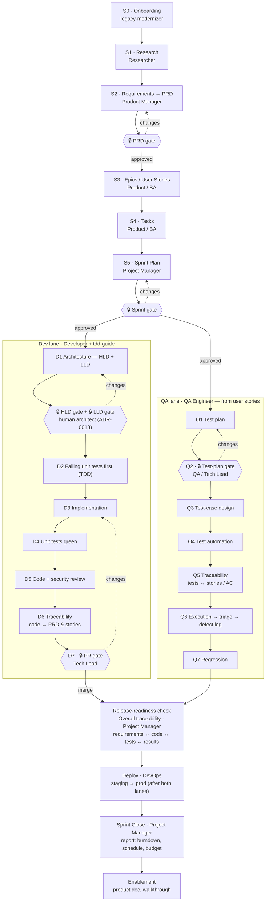

# How to Run AgentForge

> **Path convention.** Paths shown as `docs/…`, `agentforge/…` or `agentforge_custom_plugin/…` are in the AgentForge **Assets** repo. Only `docs/guides/` ships into a target (as `agentic-assets/docs/guides/`), so those are written as plain paths rather than links — a link would resolve in Assets and dangle in every target.

**AgentForge · Orchestrator & SDLC Run Guide**

This guide is how you *run* a project through the software development lifecycle with
AgentForge — end to end from S0 to enablement, the two ways to drive it, who owns each
stage, where the human-approval gates sit and who clears them, and the design for making
gate notifications and produced artifacts robust and team-visible.

Everything describing current behavior reflects what runs today. Sections explicitly
marked **Design** are proposed enhancements, called out so you can tell the two apart.

---

## Two ways to run the SDLC

AgentForge supports two operating modes over the **same** stage graph, agents, gates, and
artifacts. The difference is only *who advances the pipeline*.

| | **Agentic Automated** | **Agentic Manual** |
|---|---|---|
| Driver | `/agentforge "<objective>"` sequences every stage, spawns each role agent, records state, and pauses at gates | You run each command yourself, one stage at a time |
| Best for | A whole feature/product from a one-line objective; hands-off runs with review gates | Surgical work — one PRD, one plan, one test pass; joining an existing project mid-stream |
| State | `run.json` + `gates.json` track progress; `--resume` restores after a break | No run file needed; each command is self-contained and idempotent |
| Gates | Enforced automatically — the run blocks until a human decides | You invoke the gated command; the same gate still opens and blocks writes |
| Domain context | Auto-injected per stage via `discover_plugins.py` | Each role agent self-discovers plugins via `Glob` when run standalone |

**They are not exclusive.** A common pattern is Automated through the backlog, then Manual
for a specific implementation slice, then back to `--resume`. Every command below runs
**independently** — `/prp-plan`, `/test-plan`, `/quality-gate`, `/prp-commit` all work on
their own without an active `/agentforge` run.

---

## The end-to-end SDLC flow (S0 → enablement)

Each stage is owned by a role (its agent). Diamonds are human-approval **gates**; the run
cannot pass a hard gate until a person approves.

This is the **canonical SDLC** defined in
ADR-0008 (`docs/decisions/ADR-0008-canonical-sdlc-stages.md`), amended by ADR-0013
(`docs/decisions/ADR-0013-architecture-hld-lld-hard-gates.md`), which puts two human-architect
hard gates on architecture.



**Linear → fork → converge.** The pipeline is linear through the backlog and **sprint plan**
(Project Manager, hard-gated), then **forks into two role lanes that run in parallel:**

- **Dev lane** (Developer + tdd-guide): architecture — a High-Level and a Low-Level Design,
  **each a hard gate approved by a human architect, no override** (ADR-0013) → failing unit tests
  first (**TDD**) → implementation → unit tests green → code + security review → traceability
  (code ↔ PRD & stories) → **PR, a hard gate reviewed by the Tech Lead**.
- **QA lane** (QA Engineer, working from the **functional requirements / user stories**):
  test plan → **test-plan review, a hard gate** → test-case design → test automation →
  traceability (tests ↔ stories / AC) → execution → triage → defect logging → regression.

Both lanes converge on the **Project Manager's release-readiness check** (overall traceability,
requirements ↔ code ↔ tests ↔ results), then **DevOps deploy** (staging → production, only
after *both* lanes pass), then **Sprint Close** (report) and **Enablement**.

> **Design vs. implementation.** The diagram is the canonical *design* (ADR-0008 + ADR-0013). The
> orchestrator advances a single linear `run.json` cursor — the lanes are a role overlay, not two
> simultaneous cursors — through the flat order S0–S17 below. Two things differ from the drawing:
> the release-readiness `trace-matrix` (S12) runs **before** the PR review gate (S13), so the PR
> approver sees full traceability; and S14 `ship` has no gate of its own — approving S13 *is*
> shipping. ADR-0008's implementation status records what is still open: three-level traceability
> (today one `trace-matrix` renders the whole matrix and the PM confirms it) and naming a QA-Lead
> approver on the test-plan gate.

### Canonical stage → code stage → owner → gate

This is the order `run_state.STAGE_SEQUENCE` actually walks (`agentforge/src/state/run_state.py`).

| # | `run.json` id | Lane | Owner (agent / command) | Gate |
|---|---|---|---|---|
| S0 | `onboarding` | — | `legacy-modernizer` *(brownfield only)* | soft |
| S1 | `research` | — | `researcher` | — |
| S2 | `requirements` | — | **`product-manager`** | **🔒 hard** — PRD |
| S3 | `epics` | — | `epic-writer` | — |
| S4 | `tasks` | — | `task-writer` | — |
| S5 | `sprint-plan` | — | **`project-manager`** | **🔒 hard** — sprint plan |
| S6 | `test-plan` | QA | **`qa-engineer`** (derived from the user stories) | **🔒 hard** — test plan |
| S7 | `architecture` | Dev | **`architect`** → `hld.md`, `lld.md`, `risk-assessment.md` | **🔒 hard ×2** — HLD and LLD, human architect (ADR-0013) |
| S8 | `build` | Dev | `developer` + `tdd-guide`, per task | — |
| S9 | `test-automation` | QA | `qa-automation-engineer` (tests bound to TC-IDs) | — |
| S10 | `test-run` | QA | *(no agent)* `/test-run` → JUnit XML | — |
| S11 | `triage` | QA | `test-triage` | — |
| S12 | `trace-matrix` | convergence | `qa-engineer` produces it; **Project Manager** confirms it (release readiness) | fail-loud verdict, not a `gates.json` entry — the stage only completes with `(PASS)` |
| S13 | `review` | Dev | **`team-lead`** (fans in `code-reviewer`, `security-reviewer`, `pr-test-analyzer`, language reviewers) | **🔒 hard, no override** — tied to `gh pr create` |
| S14 | `ship` | — | *(bookkeeping)* | — completes when the PR is created |
| S15 | `deploy` | — | `devops` → CI workflow + deploy plan (never an actual deploy trigger) | — |
| S16 | `sprint-close` | — | `project-manager` → completion report, burndown, budget report | — only real when this run closes the sprint |
| S17 | `enablement` | — | *(no agent)* `/product-doc`, `/marketing-video --technical-walkthrough` | — only runs when S16 closes the sprint |

**S0 is conditional — on three states.** The orchestrator classifies the target first:

```bash
python agentforge/src/state/run_state.py classify-target --project-root .
```

| Verdict | Meaning | S0 action |
|---|---|---|
| `brownfield` | existing source, **no** memory bank | spawn `legacy-modernizer` with memory-bank writes authorized |
| `onboarded` | memory bank present (`docs/context/REPO_MAP.md`) | skip, recorded with that reason |
| `greenfield` | no memory bank **and** no meaningful source | skip, recorded with that reason |

**S17 walkthrough needs a human.** `/marketing-video --technical-walkthrough` builds from a real
screen recording, which the command cannot make for you; until a person records one, enablement
records the walkthrough as deferred with a reason (the DCN reference run below did exactly this).

---

## Running Agentic Automated mode

```bash
/agentforge "PPE detection portal for the shop floor"
```

The orchestrator spawns each stage's role agent, passes artifacts forward, records
`run.json` after every transition, and blocks at each hard gate for a human decision. It must
run in the **main session** — it spawns subagents and asks you through `AskUserQuestion`, and a
subagent can do neither.

**Where a run's files live.** One objective, one folder. `run.json`, `gates.json` and
`sprint-NN.json` live in `neuroedge/docs/project_related/<objective-slug>/03-execution-plan/`,
never at the repo root. Every state command takes explicit paths, so set them once per shell:

```bash
RUN="neuroedge/docs/project_related/<objective-slug>/03-execution-plan/run.json"
GATES="neuroedge/docs/project_related/<objective-slug>/03-execution-plan/gates.json"
```

```
neuroedge/docs/project_related/<objective-slug>/
  00-objective.md
  01-research/            S1
  02-project-plan/        S2 PRD.md · S3 epics-and-user-stories.md · S4 task-board.md
  03-execution-plan/      run.json · gates.json · sprint-NN.json
  04-development/         S7 hld.md · lld.md · risk-assessment.md
  05-quality/             S6 test-plan.md · S10 test-results.xml, tc-results · S12 traceability.md
  06-delivery/            S14–S16 delivery records
  runlog.md               one row per stage: key counts, Tokens (stage), Tokens (cumulative), source
```

Commands run on their own, outside a run, keep their state under
`neuroedge/docs/project_related/runs/` instead.

**Flags**

- `--status` — one screen: current stage, blocker, owner, and a token summary. No writes.
  ```bash
  python agentforge/src/state/run_state.py --path "$RUN" --gates-path "$GATES" status
  ```
- `--resume` — restore stage + gate state after a break. Exit `0` = clear to continue;
  exit `3` = a gate survived and is still pending — decide it first.
  ```bash
  python agentforge/src/state/run_state.py --path "$RUN" --gates-path "$GATES" resume
  ```
- `--dry-run` — print the remaining stage sequence and which agent each would spawn. Zero
  side effects (`run_state.py --path "$RUN" preview`).
- `--stage <id>` — join at an already-produced stage (e.g. you already wrote
  `02-project-plan/PRD.md` by hand); earlier stages are marked complete "supplied outside this
  run." Any id in the table above is valid. On an existing run, resume or start over instead.
- `--stage bootstrap` — the **onboarding fast lane** for a legacy repo with no objective yet:
  runs `/legacy-audit . --memory-bank --subfolder-claude --plan`, creates no `run.json`, advances
  no stage. Afterwards `classify-target` reports `onboarded`, so a later
  `/agentforge "<objective>"` skips S0. It stops on a `greenfield` target and asks before
  refreshing an `onboarded` one.
- `--fix "<defect>"` — the **defect fast lane**: triage → failing test → fix → review → PR for a
  single defect, *outside* the S0–S17 pipeline (no `run.json`). Identical to the standalone
  `/fix "<defect>"` command — both run `skills/SDLC/development/defect-fix.md`. Use full
  `/agentforge` for a new objective; `--fix` (or `/fix`) for a bug; the PRP fast lane
  (`/prp-plan` → `/prp-implement` → `/prp-pr`) for an incremental change. See
  `fast_lane_and_defect_fixing.md`.

**Re-running a stage.** `reopen` re-arms a completed stage so the loop runs it again (spawn
history kept). Its main use is S12: if more scope lands after `trace-matrix` passed, reopen it
before S13 so the verdict matches what shipped.
```bash
python agentforge/src/state/run_state.py --path "$RUN" reopen trace-matrix
```

**Token telemetry.** Each stage records its token/cost usage in `run.json`, including failed
attempts (`fail` takes the same flags, and passes accumulate). Every figure carries a
`--source`: `measured` (from a spawn's reported usage — the default when a figure is given),
`estimated` (derived — used for stages the orchestrator does itself, method stated in the
runlog), or `unrecorded` (no figure — **not a zero**; `usage` then reports the total as a lower
bound). For commands run **outside** `/agentforge`, `/budget-report --commands` rolls up
per-command usage from `neuroedge/docs/project_related/misc/runlog-<command>-<arg-slug>.md`. See where
the budget is going and which stage to optimize first:
```bash
python agentforge/src/state/run_state.py --path "$RUN" usage          # per-stage table + top consumer
python agentforge/src/state/run_state.py --path "$RUN" usage --json   # machine-readable
```

## Running Agentic Manual mode

Every stage has a standalone entry point. Run only what you need; the same gates still fire.

| Intent | Command |
|---|---|
| Onboard a legacy repo (memory bank + `CLAUDE.md` hierarchy) | `/legacy-audit . --memory-bank --subfolder-claude --plan` |
| Research before a PRD | `/research "<topic>" --type combined` |
| Write / refine the PRD | `/prp-prd` |
| Migration PRD for a breaking redesign (from accepted ADRs) | `/prp-prd-migration <ADR paths or decisions dir>` |
| PRD → epics + stories | `/prd-to-epics neuroedge/docs/project_related/<objective-slug>/02-project-plan/PRD.md` |
| Stories → task board | `/stories-to-tasks` |
| Architecture (HLD / LLD / risks) | `/architecture <feature description \| path/to/prd.md>` |
| Plan a slice | `/prp-plan "<feature or bug>"` |
| Implement a plan | `/prp-implement <plan>` |
| Fix one defect (triage → failing test → fix → review → PR) | `/fix "<defect>"` (`--no-pr` stops after review) |
| Test plan + traceability | `/test-plan`, `/trace-matrix` |
| Run tests (auto-detect framework) | `/test-run` · `/test-run --target staging TC-02-*` |
| Lint + typecheck gate | `/quality-gate .` |
| Coverage | `/test-coverage` |
| Commit / PR | `/prp-commit "<message>"`, then `/prp-pr` |
| Sprint mechanics | `/sprint-plan`, `/sprint-report --close`, `/sprint-report --burndown`, `/budget-report` |
| Simulate a data source or an external system | `/simulator "<ask>"` — see [Simulating external systems](#simulating-external-systems-during-a-run) |
| ML model: dataset → handoff package | `/dataset-scout`, `/auto-label`, `/synth-data`, `/model-select`, `/model-build` — see [how_to_build_ml_model.md](how_to_build_ml_model.md) |
| Enablement | `/product-doc`, `/marketing-video` — see [how_to_create_marketing_video.md](how_to_create_marketing_video.md) |
| Publish run state / pull drive intents | `/exchange export`, `/exchange import-intents`, `/exchange apply` — see [how_to_integrate_agentforge_to_external_tools.md](how_to_integrate_agentforge_to_external_tools.md) |

---

## Gates — who approves, and how

A gate is a hard stop where a human decides **Approve / Request changes / Reject**. Only
*Approve* clears it; the decision is recorded with identity and timestamp, and nothing
proceeds past a hard gate silently.

ADR-0008 defines **four hard gates**; ADR-0013 adds **two more** on architecture. Artifact
paths below are relative to `neuroedge/docs/project_related/<objective-slug>/`:

| Gate (artifact) | Stage | Type | Approves it — *recommended owner* | How it is decided today |
|---|---|---|---|---|
| `02-project-plan/PRD.md` | S2 requirements | hard | **Product Manager / sponsor** | `AskUserQuestion` in the main session → `gate_state.py decide` |
| `03-execution-plan/sprint-NN.json` | S5 sprint plan | hard | **Project Manager** | same |
| `05-quality/test-plan.md` | S6 test-plan (QA lane) | hard | **QA Lead / Tech Lead** | same |
| `04-development/hld.md` | S7 architecture (Dev lane) | hard, **no override** | **human architect** (ADR-0013) | same — the orchestrator opens it, because the architect agent has no gate CLI |
| `04-development/lld.md` | S7 architecture (Dev lane) | hard, **no override** | **human architect** (ADR-0013) | same; S8 build cannot start until both are approved |
| `pr:<branch>` | S13 review (the PR gate) | hard, **no override** | **Tech Lead** *(team-lead's fan-in verdict is shown with the ask)* | `AskUserQuestion`, tied to `gh pr create` |
| `REPO_MAP.md` | S0 onboarding | soft (advisory) | — | advisory only, never blocks |

*(The S12 release-readiness / overall-traceability check is a fail-loud PM convergence verdict,
not a `gates.json` entry.)*

Mechanism today:
```bash
python agentforge/src/state/gate_state.py --path "$GATES" status                         # what's blocked
python agentforge/src/state/gate_state.py --path "$GATES" open <artifact> --stage <S#> \
    --type hard [--opened-by <who>]                                                      # --opened-by rejects self-approval
python agentforge/src/state/gate_state.py --path "$GATES" decide <artifact> \
    <approved|changes_requested|rejected> --identity <who> [--reason "..."]
python agentforge/src/state/gate_state.py --path "$GATES" reopen <artifact>              # re-arm, keeping decision history
python agentforge/src/state/gate_state.py --path "$GATES" audit                          # approval-rate audit
```

Two hooks enforce this outside the orchestrator's own discipline: `stop-hitl-gate.js` will not
let a session end while any gate is `pending`, and `pre-write-hitl-gate.js` blocks edits to an
already-approved gated artifact and blocks `gh pr create` until the PR gate is `approved`.

> **Current limitation (honest boundary).** `gates.json` records a single human `identity`
> per decision; it does **not** yet carry a *per-gate assignee*, so the mapping of gate →
> role owner in the table above is the recommended operating convention, not something the
> tool enforces. Adding a per-gate assignee (so the right role is notified and only they can
> clear it) is the natural next enhancement — see the notification design below.

---

## Design — robust gate notifications

**Problem.** Gate approval is the one place the pipeline waits on a human. Today
`gate_state.open_gate()` fires a best-effort **OS desktop notification** (`_notify`): a
Windows toast (WinRT), macOS `osascript`, or Linux `notify-send`. That is fine when you are
at the machine, but the Windows toast is inconsistent (focus-assist suppression, session
state) and useless when the approver is away or is a *different person* than the operator.

**Approach — keep the toast, add a robust channel.** Make notification **layered**: the
local toast stays as the instant, zero-config signal, and one or more durable channels are
added for reach and team-visibility. All are best-effort and must never block the gate from
opening (the existing `open_gate` try/except contract is preserved).

```
open_gate(artifact)  ──▶  notify(event)  ──▶  [1] OS toast   (existing, local, instant)
                                              [2] Email      (SMTP — reaches an away approver)
                                              [3] Work item  (Jira comment / GitHub issue — team-visible, audit trail)
```

Proposed config — `.claude/pm/notify-config.json` (repo-local, gitignored; secrets via env):

```json
{
  "channels": ["toast", "email", "jira"],
  "email":  { "smtp_env": "AGENTFORGE_SMTP_URL", "to": ["pm@acme.com", "techlead@acme.com"] },
  "jira":   { "config": ".claude/pm/jira-config.json", "notify": "comment", "assignee_by_gate": {
                "docs/PRD.md": "pm@acme.com", "pr:*": "techlead@acme.com" } },
  "github": { "repo": "acme/portal", "notify": "issue-comment" }
}
```

Behavior:
- **Email** is the reliability floor — it reaches an approver who is not at the machine, and
  the message carries the artifact, stage, the exact `gate_state.py decide` command, and a
  link to the artifact/PR.
- **Jira / GitHub** turns the gate into a *team-visible, auditable* event: a comment on the
  tracking issue (or a transition to "Needs approval"), optionally `@`-assigning the
  recommended role owner. This is where the per-gate assignee from the limitation above
  earns its keep — the right person is pinged, not just "whoever ran it."
- Each channel is independent and wrapped so a failing SMTP host or Jira outage degrades to
  the next channel and never stalls the run.

Implementation note: this slots into the existing `_notify` seam in `gate_state.py`; the
Jira path reuses `agentforge/src/pm/jira_sync.py`'s "never raise on network failure" adapter
pattern, and the config mirrors the already-established `.claude/pm/jira-config.json`
"vendor / none / decide later" prompt-once model — so no channel is required to be set.

---

## Design — every artifact is a tracked Configuration Item (CI)

**Idea.** Each SDLC stage produces an artifact (PRD, architecture, epics, tasks, test plan,
traceability, sprint plan, PR, deploy plan). Treat every one as a **Configuration Item** in
a system of record — a Jira issue or a GitHub issue — so artifacts are versioned, linked,
assignable, and auditable outside the repo, and a run can be *seeded from* existing items
rather than always starting blank.

Two operations wire into the SDLC:

**1. Fetch (seed / resume from the system of record).** Before a stage runs, pull any
existing CI for that artifact so the run reflects reality instead of regenerating work:
- `/agentforge --stage architecture` already supports "artifact supplied outside this run."
  Extend it: if a Jira/GitHub issue for the PRD exists (by label/key), fetch its content and
  attachments to seed S2 as complete, recording the issue key in `run.json`.
- On `--resume`, reconcile `run.json` against the tracker so a gate approved in Jira (or an
  issue closed) is reflected locally.

**2. Deposit (register the produced artifact as a CI).** On each stage `complete`, register
its artifact in the tracker and record the returned key alongside the artifact path:

```
complete_stage(stage, artifacts=[path], usage=...)
        │
        └─▶ ci_register(stage, path)  ──▶  Jira: create/update issue, attach or link file,
                                            set fixVersion=sprint-NN, label agentforge:<stage>
                                       ──▶  GitHub: create/update issue, attach as gist/commit
                                            link, apply label agentforge/<stage>
        └─▶ run.json.stages[stage].artifacts gains {"path": ..., "ci": "PORTAL-123"}
```

**Wiring points** (minimal, reuses what exists):
- The `complete` transition in `run_state.py` is the single deposit hook — every stage
  passes through it, so one call site covers the whole graph.
- Gate decisions (`gate_state.py decide`) transition the linked issue (e.g. PRD issue →
  "Approved") so the tracker and `gates.json` never disagree — the same reconciliation the
  notification design assigns owners for.
- Reuse the established adapter shape: `agentforge/src/pm/jira_sync.py` (`push_sprint_backlog`,
  `push_issue_status`) for Jira and the QA vendor adapters (`zephyr_adapter.py`,
  `testrail_adapter.py`) as the template for a `github_issue_adapter.py`. All follow the
  "never raise on network/tool failure" rule, so CI registration is best-effort and a
  tracker outage degrades to "recorded locally, sync later."
- Config via the same `.claude/pm/*.json` prompt-once model (`jira` / `github` / `none` /
  `decide later`); with no tracker configured, artifacts stay repo-local exactly as today.

**Contract (both trackers).**

| Operation | Jira | GitHub Issues |
|---|---|---|
| Fetch by artifact | JQL on `label = agentforge:<stage>` (+ fixVersion) | issues filtered by `label:agentforge/<stage>` |
| Deposit new | create issue, attach/link file, label, set sprint | create issue, link file (gist/commit), label |
| Update on re-run | update same issue (idempotent by stored key) | update same issue (idempotent by stored key) |
| Approve on gate | transition (e.g. → Approved) | comment + `agentforge/approved` label |
| Store key | `run.json` stage artifact `ci` field | same |

The result: `run.json` remains the local source of truth for a run, while every produced
artifact also lives as a first-class, linkable item in the team's tracker — traceable from
requirement to PR to deploy without leaving Jira or GitHub.

**What exists today.** Part of the outbound half already runs: `/exchange export`
(`agentforge/src/exchange/exchange_cli.py`, ADR-0012) builds a record from `run.json` +
`gates.json` and pushes it to a repo-local file and GitHub Issues. When the target's
`exchange_config.json` sets `"auto_export": true`, the orchestrator exports at gate and terminal
transitions only. Inbound (`import-intents` / `apply`) stays a deliberate human act, and an
inbound intent can never clear a pending hard gate. Per-artifact CI registration and Jira remain
design. See [how_to_integrate_agentforge_to_external_tools.md](how_to_integrate_agentforge_to_external_tools.md).

---

## Domain plugins (auto-discovered) in both modes

Product/client-specific context lives in a **custom plugin** under
`agentforge_custom_plugin/<Name>/` — kept separate from the base SDLC assets so the generic
pipeline stays clean. **Presence is activation:** any `plugin.json` with `wiring.auto_load`
not `false` is picked up automatically, no install step, no registry.

- **Automated mode:** before each stage's agent spawns, the orchestrator runs
  `python agentforge_custom_plugin/discover_plugins.py --stage <id>`, which reads each active
  plugin's `wiring.stage_context` map and passes the exact context files that stage needs
  (plus any `skills/SUBJECTS/<Subject>/` the plugin declares via `requires_subjects`) as
  binding domain context.
- **Manual mode:** each role agent self-discovers active plugins via `Glob` when run
  standalone, so the same context flows.

Setup auto-scaffolds a neutral `Project_Specific_Context/` template into every project — fill
in its `context/*` files and the SDLC infuses them at the right stage. See
[`agentforge_assets.md`](agentforge_assets.md#custom-domain-plugins-agentforge_custom_plugin) and
`agentforge_custom_plugin/README.md`.

---

## Engineering disciplines in a run

A project that builds more than software declares its disciplines, for example
`active_disciplines: [ai-ml]` in `CLAUDE.md` or the project config. Discipline assets live under
`skills/ENGINEERING/ai-genai/`, `skills/ENGINEERING/ai-ml/`, and the `embedded` pack at
`packs/embedded/` (ADR-0018). ADR-0010 keeps the stages and gates above unchanged; a discipline
changes how a stage is *realized*, not the stage graph.

**Honest boundary.** `commands/agentforge.md` does not dispatch stages by discipline yet: in a
run, invoke the discipline's commands yourself (Manual mode) at the stage they belong to. The
`ai-ml` hooks need no invocation — `pre:bash:ml-artifact` blocks committing weight or dataset
blobs, `post:edit:ml-leakage` flags leakage smells in training code, and
`stop:eval-gate-reminder` requires an `ml-eval-reviewer` pass after training code changes. The
`ai-ml` discipline generates model and training code plus a handoff package; it never runs
training (ADR-0014). Walkthrough: [how_to_build_ml_model.md](how_to_build_ml_model.md).

---

## Simulating external systems during a run

Build and test stages often need systems you do not have yet: a device fleet, a partner API, a
tool server, a model provider. AgentForge ships a simulator for that, installed into a target as
`agentforge_simulator/` (source `simulator/` in Assets). `/simulator "<ask>"` composes a run for
you, or hands a new format or transport to the `simulator-builder` agent. Install its
dependencies once:

```bash
pip install -r agentforge_simulator/requirements.txt
```

**Replay mode — stream files over a transport.** Put files in `agentforge_simulator/sim_input/`
(or generate them), pick a transport (`console`, `sse`, `mqtt`, `webhook`, `api`), and read what
was sent from `sim_output/`:

```bash
python agentforge_simulator/gen_input.py --profile sensor --rows 500 --seed 42
python agentforge_simulator/simulator.py --transport mqtt --mqtt-host localhost \
    --mqtt-topic edge/telemetry --rate 10 --loop -1
```

`gen_input.py` profiles are `edge_device`, `sensor`, `enterprise_ops`, and
`cyclic_multichannel` — correlated multi-channel work cycles with `--drift
{none,ramp,ramp-recover,step}` and a `--recipe` sidecar. That last one is the time-series ML
training source used in [how_to_build_ml_model.md](how_to_build_ml_model.md). For SSE, add
`--sse-wait` so a late client still gets the stream.

**Scenario mode — stand in for the systems your agents call.** Copy
`agentforge_simulator/scenarios/_base/` beside your use case, fill in `scenario.yaml` (seed,
clock, hubs, ports, endpoint overlay) and each hub's `sim.yaml`, then:

```bash
python agentforge_simulator/simulator.py --scenario <path>/scenario.yaml            # serve until stopped
python agentforge_simulator/simulator.py --scenario <path>/scenario.yaml --play-once # exit when the timeline ends
python agentforge_simulator/simulator.py --scenario <path>/scenario.yaml --hub <id>  # one hub + shared (debug)
```

It prints a JSON summary naming the run log, and writes each process's bound ports to
`run/ports.<scope>.json` (`ports.all.json` for a full run). A bundle can serve these faces:

| Face | Authored in | Answers |
|---|---|---|
| HTTP by path | `routes/*.routes.json` | exact `(method, path)` — captures, feeds, templated responses, seeded latency/error faults |
| HTTP by role and caller | `fixtures/*.json` | `/<role>/<capability>`, resolving `(role, caller, capability)` then `(role, capability)`; an entry's `matches` narrows it to *what* was asked (e.g. one SKU) |
| Tool server | `mcp/servers.json` (generated from discovery) + `mcp/responses.json` (authored) | `initialize`, `tools/list`, `tools/call` — a `servers.json` whose `source` is not `discovery-cache` is refused |
| Model | `models/responses.json` | canned answers keyed by model reference and prompt fingerprint — no key, no spend, same answer twice |
| Database | `seed/*.csv` | a real SQLite file, `run/scenario.sqlite`, rebuilt every run |
| Broker capture | topics the scenario declares | records what a tool published; a publish to an undeclared topic fails loudly |

Both HTTP schemes share one process and one port: an exact route match wins, then the fixture
store, then a **loud 404** — never a silent empty 200. The caller arrives in the
`X-NeuroEdge-Caller` header as `key=value;key=value`, and the key naming the caller defaults to
`caller`. If your host spells it differently (`hub_id`, `tenant`), set `caller_key:` in
`scenario.yaml`. An empty value, or one containing `=` or `;`, is refused. Otherwise, caller-scoped
fixtures would silently fall back to the shared answer. Each external system is simulated
exactly once (the loader refuses two hubs configuring the same system). Going real means putting
the production address back into the same `env:` overlay field.

---

## A real run to compare against

`docs/project_related/dcn-fleet-orchestration/` in the Assets repo (not shipped to targets) is a
complete S0→S17 run through the orchestrator, one sprint. Use it to see what the artifacts look
like in practice:
- `runlog.md` — the per-stage ledger with separate `Tokens (stage)` / `Tokens (cum.)` columns and
  a `Source` column, a gate table, and a run-decisions table.
- `03-execution-plan/gates.json` — PRD, sprint, test-plan, HLD, and LLD approvals, each with its
  conditions written into `--reason`.
- `03-execution-plan/run.json` — honest completions: S0 skipped as `onboarded`; S11 completed
  without spawning because S10 produced zero failures; S12 recorded as `(PASS)` with its scope
  stated beside it; the S17 walkthrough deferred because it needs a human screen capture.

In the Assets repo the objective folder sits at `docs/project_related/<slug>/`, without the
`neuroedge/` prefix a target uses.

---

Companion guides: [Installing AgentForge](how_to_install_agentforge.md) ·
[How AgentForge Improves the SDLC](how_agentforge_improves_project_SDLC.md) ·
[Assets Inventory](agentforge_assets.md) ·
[How to Build Your Project](how_to_build_your_project.md) ·
[Fast Lane and Defect Fixing](fast_lane_and_defect_fixing.md) ·
[Integrating External Tools](how_to_integrate_agentforge_to_external_tools.md) ·
[Building an ML Model](how_to_build_ml_model.md) ·
[Creating a Marketing Video](how_to_create_marketing_video.md) ·
[What Ships to a Target](review_surplus_files_to_target.md).

*Standalone reference document — no external requests.*
