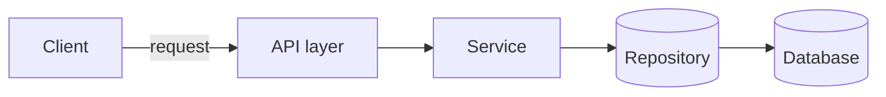
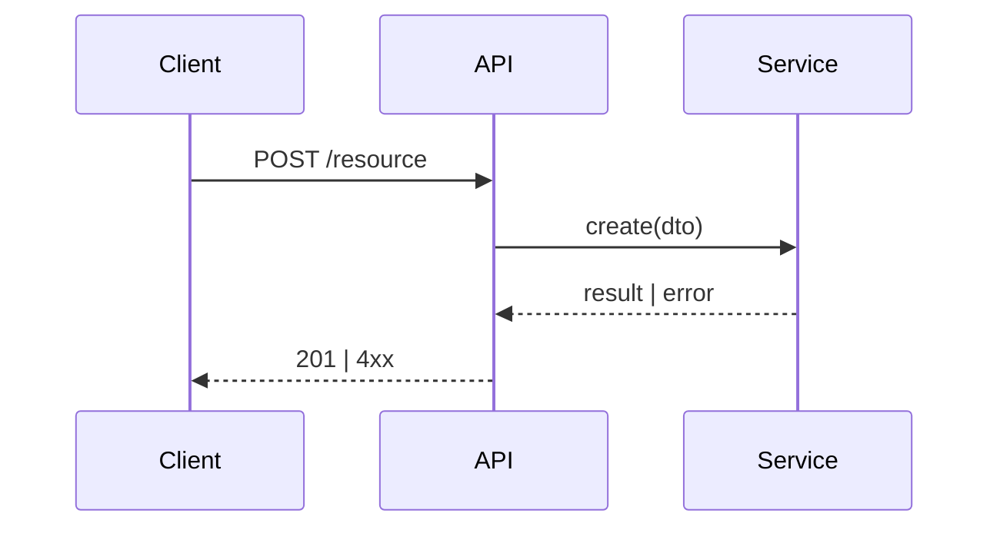

# Architecture Design

Turn an approved PRD into a design contract an implementer can build against without
rediscovering decisions mid-PR. The output is a single reviewable artifact,
`neuroedge/docs/project_related/<objective-slug>/04-development/architecture.md` (`<track>` = the objective's PRD group —
`backend`, `portal`, `industries`, …), that a human approves at the S3 hard gate. Nothing
downstream — plan, backlog, build — should proceed until it is approved.

This skill produces the design. Risk analysis is a sibling artifact — see [[risk-assessment]].

## When to Use

- The PRD (or a PRD phase) is approved and the next stage is architecture
- A feature crosses more than one component, service, or layer
- Implementation would otherwise begin with the design living only in someone's head
- A reviewer needs a concrete contract to approve at the S3 gate

## Non-Negotiable Rules

- **Design against the codebase that exists, not an ideal one.** Read the real modules,
  interfaces, and patterns first; mirror them. An architecture that ignores current
  conventions is rejected at the gate.
- **Every diagram is text (Mermaid), never an image.** It must diff in review and survive
  in git. A screenshot is not an architecture.
- **Separate what is decided from what is open.** A design with hidden open questions fails
  at implementation. List them explicitly and mark the gate blocked if any is load-bearing.
- **Do not invent requirements.** If the PRD is silent on something the design needs, that
  is an open question for the gate, not a decision to make silently.
- **Name the patterns you are committing to.** "Follow good practice" is not a contract.
  Point at the specific pattern skills the build must follow.

## The Artifact — `neuroedge/docs/project_related/<objective-slug>/04-development/architecture.md`

Produce these sections in order.

### 1. Design summary
Three to five sentences: what is being built, the shape of the solution, and the single most
consequential decision. If this is weak, the rest will drift.

### 2. Context and scope
- **In scope:** the concrete boundaries of what this design covers.
- **Out of scope:** what it explicitly does not, so the build does not creep.
- **Assumptions:** what must be true for this design to hold.

### 3. Component view
A Mermaid component/container diagram showing the parts and their relationships. Keep it to
the components this feature touches — not the whole system.

For each component: its responsibility in one line, and which existing module it maps to
(`src/...`) or that it is new.

### 4. Sequence view
A Mermaid sequence diagram for each significant flow — at minimum the primary happy path and
one consequential failure or boundary path. This is where interface timing and ownership
become concrete.

### 5. Interface contracts
For each interface the feature introduces or changes: signature, inputs, outputs, error
modes, and pre/postconditions. This is the contract the implementer and the test author both
bind to. Prefer the codebase's existing contract style (`api-design`, `backend-patterns`).

### 6. Data model and state
- Data shapes introduced or changed, and their ownership.
- State transitions, as a Mermaid `stateDiagram-v2` where a lifecycle exists.
- Migration or backward-compatibility implications, if any.

### 7. Finalized patterns and guidelines
The specific patterns the build MUST follow, cited by skill path so `/prp-plan` and the
`developer` agent inherit them rather than choosing anew:
- Architecture pattern — e.g. `skills/SDLC/development/hexagonal-architecture.md`
- Language patterns — e.g. `skills/SOFTWARE/python/python-patterns.md`
- Coding standards — `skills/SDLC/development/coding-standards.md`
- API/data conventions — `skills/SDLC/development/api-design.md`, `backend-patterns.md`
State any deviation from a codebase convention here, with the reason, so it is a decision on
the record rather than a surprise in review.

### 8. Alternatives considered
The main options weighed and why the chosen one won. One or two is enough; this exists so the
gate reviewer sees the trade space, not to pad.

### 9. Decisions to record as ADRs
List each load-bearing decision that should outlive this document as an ADR under
`docs/decisions/`. The architecture doc summarises; the ADR is the durable record.

### 10. Open questions (gate blockers)
Anything unresolved that implementation depends on. Each is owned and, if load-bearing,
blocks the S3 gate until answered. An empty list is a valid and good outcome — say so.

## Handoff

End with one line: **ready for the S3 gate**, **needs one more design pass**, or **blocked on
an open question** (name it). Then point to [[risk-assessment]] as the required sibling artifact
before the gate closes — a design without its risks assessed is only half the contract.
