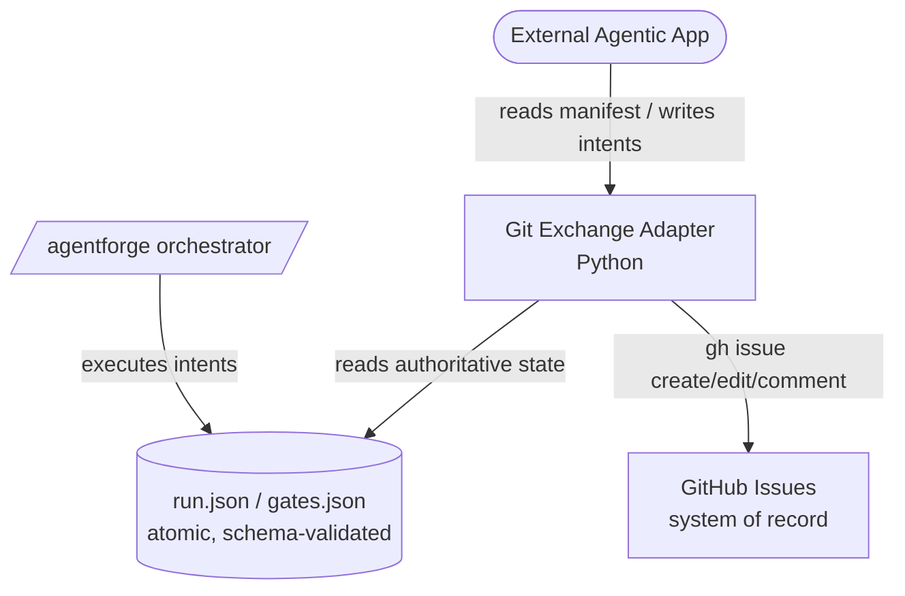
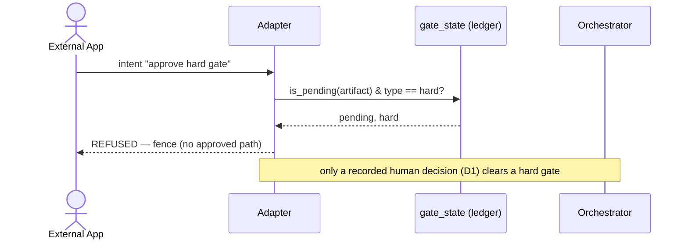

# Architecture Diagrams

Diagrams are the architect's primary communication artifact. A design contract that a builder
cannot follow because the structure and interactions were never drawn is a weak design. Produce
diagrams **as code** (Mermaid, never images) so they live in the repo, version with the code, and
review in the same PR. **Only draw diagrams that add value** — match each to its audience and level.

## The C4 model — pick the level for the audience

The C4 model is a hierarchy of static-structure diagrams at four zoom levels. You rarely need all
four; **context + container are sufficient for most teams**, adding component/code only where depth
earns its keep.

| Level | Shows | Audience | When to draw |
|---|---|---|---|
| **1 — System Context** | The system as one box, its users/actors, and the external systems it talks to | Everyone (incl. non-technical) | Almost always — the "gateway" diagram |
| **2 — Container** | The internal runtime pieces (services, apps, datastores, CLIs, adapters) + tech choices | The delivering team | Almost always |
| **3 — Component** | The modules/responsibilities inside one container and how they collaborate | Developers of that container | Selectively, where the internal structure is non-obvious |
| **4 — Code** | Class/function-level detail | Rarely — prefer the code itself | Almost never (generate, don't hand-draw) |

**Rule:** match the diagram to the audience — context for the big picture, container for the team,
component for selective depth. Don't put code-level detail in a context diagram or vice versa.

### C4 as Mermaid

Use `flowchart`/`graph` for structure (label nodes with responsibility + technology):

## arc42 dynamic + deployment views — behaviour, not just structure

Structure diagrams (C4) show *what the pieces are*; they do not show *how the system behaves over
time*. Add the two arc42 views that capture behaviour and infrastructure:

- **Runtime view** — the important scenarios drawn as **sequence diagrams** (below): the ordered
  message exchange for each critical flow.
- **Deployment view** — how containers map onto infrastructure/processes (draw only when it is
  non-trivial; for a library/CLI it may be N/A — say so).

## Sequence diagrams — for every critical flow

Sequence diagrams show how objects/systems communicate **in chronological order** — invaluable for
API flows, multi-step interactions, and gated/branching processes. Draw one per critical scenario
(happy path + the load-bearing failure/branch cases). Keep them **crisp** — find the line between
too simple to be useful and too complex to read.

Draw a sequence diagram for anything with ordering, gates, retries, or a fence — the interaction
*is* the design there.

## State diagrams — for state machines

When a component is a state machine (a run cursor, a gate lifecycle, a retry/backoff loop), draw a
`stateDiagram-v2`. It makes illegal transitions and terminal states obvious in a way prose hides.

## Diagram-as-code discipline

- **Mermaid, never binary images** — diagrams are source, versioned and reviewed with the code.
- **Keep them in `neuroedge/docs/project_related/<objective-slug>/04-development/architecture.md`** next to the interfaces
  and decisions they illustrate.
- **One diagram, one idea** — a diagram that needs a legend to survive is two diagrams.
- **Update the diagram in the same change as the code** — a stale diagram is worse than none.

## Minimum set for an AgentForge S7 architecture doc

1. **System Context** (C4-L1) — the feature, its actors, external systems.
2. **Container/Component** (C4-L2/L3) — the module set and responsibilities.
3. **Runtime view** — a sequence diagram per critical flow (always include any *gated* or *fenced*
   flow).
4. **State diagram** — if any component is a state machine.
5. **Deployment view** — only if non-trivial (else note N/A).

## Sources

- [C4 model — Diagrams](https://c4model.com/diagrams) · [Miro — C4 model guide](https://miro.com/diagramming/c4-model-for-software-architecture/) · [Practical C4 tips](https://revision.app/blog/practical-c4-modeling-tips)
- [arc42 — Runtime & Deployment views](https://docs.arc42.org/home/) · [Core architecture sections](https://deepwiki.com/arc42/arc42-template/3.1-core-architecture-sections)
- [Sequence diagrams in MermaidJS](https://jessems.com/posts/2023-07-22-the-unreasonable-effectiveness-of-sequence-diagrams-in-mermaidjs/) · [4 key Mermaid diagrams for developers](https://victoronsoftware.com/posts/mermaid-intro/)
